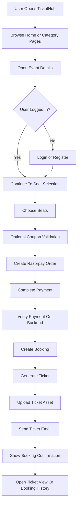
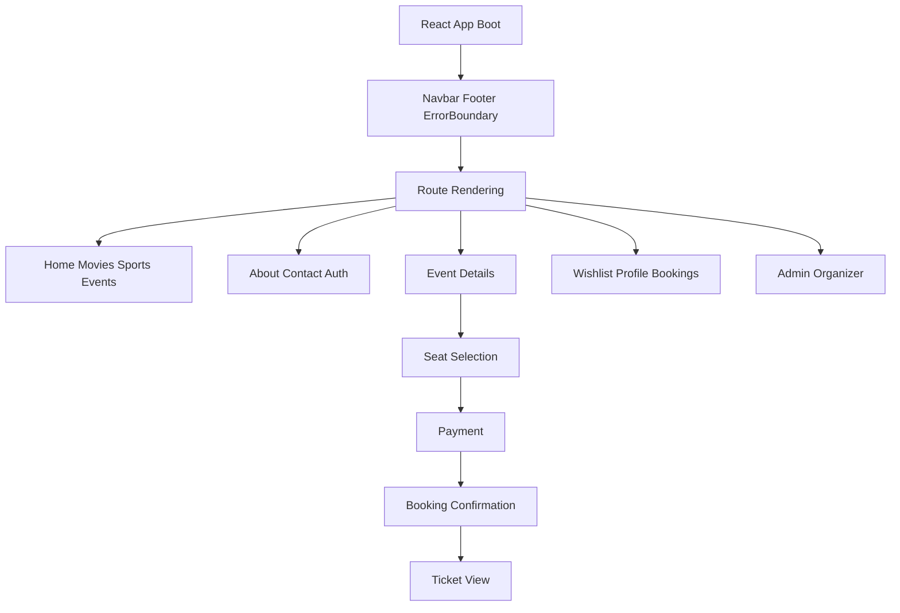
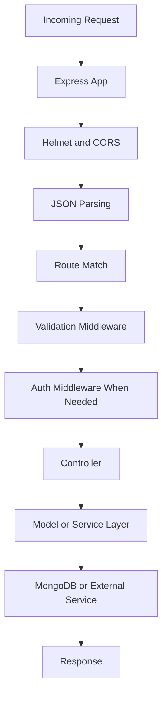
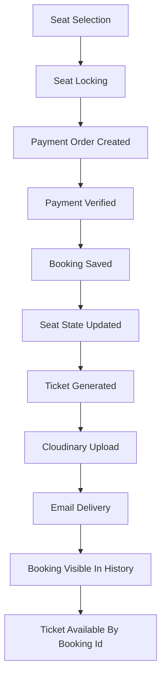
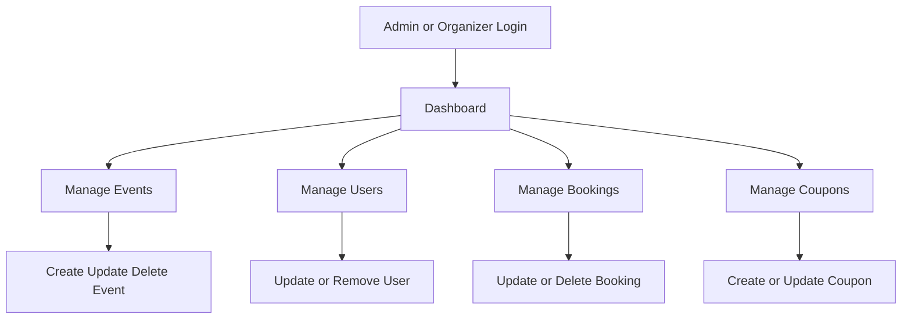

# TicketHub Flowchart

This document shows the main TicketHub flow from user entry to booking, payment, ticket delivery, and admin management.

## Main Product Flow

## Frontend Flow

## Backend Request Flow

## Booking and Ticket Lifecycle

## Admin and Organizer Flow

